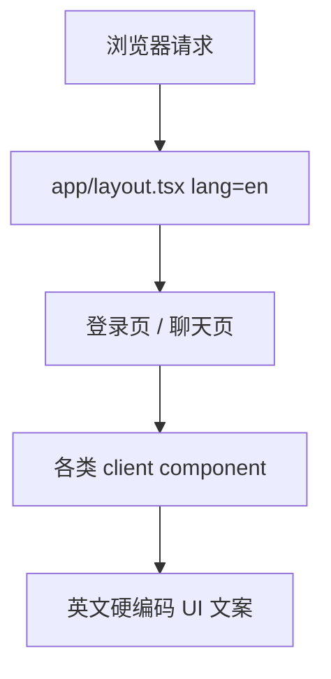

# 设计文档：支持中英双语 UI，并允许用户在右上角切换语言

## Overview

本设计在现有 Next.js App Router 项目中引入一套**轻量、可扩展、以 cookie 为中心的 UI 本地化方案**，目标是在不改动 URL 结构和聊天业务链路的前提下，为项目提供 `en` 与 `zh-CN` 两种界面语言，并允许用户在页面右上角随时切换。

设计重点：

1. 用统一的 locale 解析逻辑决定当前请求的界面语言；
2. 用本地词典管理所有预置 UI 文案；
3. 通过 Provider / Hook 让 client component 能稳定取词；
4. 通过 cookie 持久化语言偏好，并在切换后刷新当前页面；
5. 将语言切换器放入登录 / 注册页右上角与聊天页顶部右上角；
6. 控制实现复杂度，不引入 URL 前缀式多语言路由。

本设计解决的是 **UI localization**，不包含用户消息或模型回复的自动翻译。

---

## Architecture

### Current



### Target

```mermaid
flowchart TD
  Request[浏览器请求] --> ResolveLocale[读取 locale cookie / Accept-Language]
  ResolveLocale --> LoadDictionary[加载 en 或 zh-CN 词典]
  LoadDictionary --> RootLayout[app/layout.tsx 设置 html lang]
  RootLayout --> I18nProvider[I18n Provider 提供 locale 与 t()]
  I18nProvider --> AuthPages[登录 / 注册页]
  I18nProvider --> ChatPages[聊天页 / 侧边栏 / Header]

  User[用户点击右上角语言切换器] --> LocaleAPI[写入 locale cookie]
  LocaleAPI --> Refresh[router.refresh()]
  Refresh --> ResolveLocale
```

### Key Design Choices

- **不使用语言前缀路由**：保持当前 `/`、`/login`、`/register`、`/chat/:id` 路径不变。
- **使用 cookie 持久化语言偏好**：因为当前页面很多文案在服务端就决定，需要服务端可读的偏好来源。
- **词典以本地 TS 对象维护**：当前支持语言较少、文案规模中等，优先选择可控、类型友好、依赖少的方案。
- **组件级取词**：通过 provider/hook 减少在 client component 中层层透传字符串。

---

## Components and Interfaces

### 1. Locale 配置与解析

**建议新增文件：**
- `lib/i18n/config.ts`
- `lib/i18n/get-request-locale.ts`
- `lib/i18n/dictionaries/en.ts`
- `lib/i18n/dictionaries/zh-CN.ts`
- `lib/i18n/get-dictionary.ts`

**职责：**
- 定义支持的语言集合与默认语言
- 从 cookie / 请求头中解析当前语言
- 为服务端和客户端提供统一的 locale 值

**建议接口：**

```ts
export const appLocales = ["en", "zh-CN"] as const;
export type AppLocale = (typeof appLocales)[number];

export const DEFAULT_LOCALE: AppLocale = "en";
export const LOCALE_COOKIE_NAME = "chatbox-locale";

export function isSupportedLocale(value: string): value is AppLocale;
export async function getRequestLocale(): Promise<AppLocale>;
export async function getDictionary(locale: AppLocale): Promise<Dictionary>;
```

**解析优先级：**
1. 有效的 locale cookie
2. `Accept-Language` 中最匹配的受支持语言
3. 默认值 `en`

**原因：**
- 让用户手动选择优先于浏览器默认值
- 保持首次访问体验友好
- 无需新增数据库字段

---

### 2. 词典结构

**建议：** 使用**分层命名空间对象 + 点路径取词**的结构，按领域组织 key，而不是在组件中直接硬编码。

**Key 约定：**
- 词典以嵌套对象定义，例如 `chat.history.last7Days`
- `t()` 接收点路径 key，例如 `t("chat.history.last7Days")`
- 同一语义只保留一个 canonical key，避免 `historyToday` 与 `todayLabel` 这类重复命名并存
- 对规模较大的组件，优先按功能域分组，而不是按文件名分组

**示例：**

```ts
export type Dictionary = {
  common: {
    language: {
      english: string;
      chinese: string;
    };
    action: {
      cancel: string;
      delete: string;
      loading: string;
    };
    theme: {
      toggleToDark: string;
      toggleToLight: string;
    };
    toast: {
      switchLanguageFailed: string;
    };
  };
  auth: {
    back: string;
    email: string;
    password: string;
    signIn: string;
    signUp: string;
    welcomeBack: string;
    createAccount: string;
    invalidCredentials: string;
  };
  chat: {
    greeting: {
      title: string;
      description: string;
    };
    composer: {
      askAnything: string;
      searchModels: string;
    };
    history: {
      title: string;
      today: string;
      yesterday: string;
      last7Days: string;
      last30Days: string;
      older: string;
    };
    navigation: {
      newChat: string;
      deleteAll: string;
      signOut: string;
    };
    visibility: {
      private: {
        label: string;
        description: string;
      };
      public: {
        label: string;
        description: string;
      };
    };
    suggestions: string[];
  };
};
```

**覆盖范围：**
- `app/(auth)`：返回按钮、标题、表单标签、表单按钮、跳转链接、错误提示
- `components/chat/*`：侧边栏、header、欢迎语、输入区、菜单、弹窗、toast、历史记录分组、可见性标签
- `components/ai-elements/*`：tooltip、按钮可访问性标签、搜索占位符等内置界面文案
- `lib/constants.ts` 或等价 locale 模块中的建议问题集合

**不纳入词典：**
- 品牌名，如 OpenAI / Anthropic / DeepSeek / Vercel
- 用户消息、模型回复、文档正文、上传文件名等动态内容

**建议问题策略：**
- 建议问题不要求逐字翻译
- `en` 与 `zh-CN` 分别维护各自自然、可读的预置问题数组
- 若未来需要 A/B 或产品调优，可继续在 locale 维度分别调整内容

---

### 3. RootLayout 与 I18nProvider

**涉及文件：**
- `app/layout.tsx`
- 建议新增 `components/providers/i18n-provider.tsx`
- 可新增 `hooks/use-i18n.ts`

**职责：**
- 在服务端确定当前 locale 与 dictionary
- 将 locale 写入 `<html lang>`
- 为 client component 提供 `locale`、`t()` 与可选的 `setLocale()` 触发器

**建议接口：**

```tsx
interface I18nContextValue {
  locale: AppLocale;
  dictionary: Dictionary;
  t: <K extends TranslationKey>(key: K) => string;
}
```

**实现建议：**
- `app/layout.tsx` 改为异步 server component，读取 locale 与 dictionary
- Provider 只接收已解析的 locale 与 dictionary，避免在客户端重复判断
- `t()` 内部支持缺失 key 时回退到英文，并在开发环境输出告警

**好处：**
- `html lang` 与实际页面语言保持一致
- client component 不需要各自读取 cookie
- 刷新后可自动拿到服务端最新语言

---

### 4. 语言切换持久化接口

**设计决策：采用 Route Handler，而不是 Server Action**

**建议新增：**
- `app/api/preferences/locale/route.ts`

**职责：**
- 接收用户选择的 locale
- 校验是否为受支持语言
- 写入 cookie
- 返回成功 / 失败结果

**建议请求体：**

```ts
{
  locale: "en" | "zh-CN";
}
```

**响应建议：**

```ts
{ ok: true, locale: "zh-CN" }
```

**Cookie 建议：**
- `name`: `chatbox-locale`
- `path`: `/`
- `sameSite`: `lax`
- `maxAge`: 31536000（1 年）

**切换流程：**
1. 用户点击右上角切换器中的目标语言
2. client component 调用 locale persistence API
3. 成功后执行 `router.refresh()`
4. 当前路由重新按新 locale 渲染

**为何选 Route Handler：**
- 语言切换器是可复用的 client component，更适合通过 `fetch` 调用统一接口
- 错误处理更直接，便于返回结构化结果并在 selector 内控制 pending / toast
- 不依赖 form/action 语义，后续在任意页面复用更简单

**为什么不只用 localStorage：**
- `app/layout.tsx`、服务端页面与服务端生成文案需要在 SSR 阶段就知道语言
- 仅用 localStorage 会导致首屏先闪英文再切中文

---

### 5. 右上角语言切换器组件

**建议新增：**
- `components/chat/language-selector.tsx`

**职责：**
- 展示当前语言
- 提供 `English` / `中文` 两个选项
- 在选择后写入 cookie 并刷新当前页面

**UI 建议：**
- 复用现有 `DropdownMenu` / `Button`
- 显示简洁标签，如 `EN` / `中文` 或 `English` / `中文`
- 当前项显示勾选态
- 切换请求进行中时显示轻量 pending 状态，并暂时禁用重复点击
- 操作失败时复用现有 toast 体系提示用户

**放置位置：**
- `app/(auth)/layout.tsx`
  - 现有顶部只有左侧 Back 链接，改为左右布局，将切换器置于右上角
  - 在窄屏下使用单行 `justify-between` 布局，并限制按钮最小宽度，避免与 Back 链接重叠
- `components/chat/chat-header.tsx`
  - 当前 header 仅有移动端侧边栏按钮与可见性选择器，可通过 `ml-auto` 将语言切换器放到右侧
  - 若当前 header 在只读场景下隐藏可见性选择器，语言切换器仍应保留

**设计注意：**
- 用户要求的是“右上角切换”，因此切换器不应只放在侧边栏底部用户菜单中
- 桌面与移动端都要保证可见和可操作
- `router.refresh()` 期间不展示全页 loading skeleton，而是在 selector 自身展示短暂 pending 态，以减少闪烁感

---

### 6. 现有组件的本地化改造范围

#### 6.1 鉴权相关
- `app/(auth)/layout.tsx`
- `app/(auth)/login/page.tsx`
- `app/(auth)/register/page.tsx`
- `components/chat/auth-form.tsx`
- `components/chat/submit-button.tsx`
- `components/chat/toast.tsx`

#### 6.2 聊天主界面相关
- `components/chat/chat-header.tsx`
- `components/chat/greeting.tsx`
- `components/chat/preview.tsx`
- `components/chat/app-sidebar.tsx`
- `components/chat/sidebar-history.tsx`
- `components/chat/sidebar-history-item.tsx`
- `components/chat/sidebar-user-nav.tsx`
- `components/chat/visibility-selector.tsx`
- `components/chat/multimodal-input.tsx`
- `components/chat/suggested-actions.tsx`
- `lib/constants.ts`

**特别说明：**
- `components/chat/sign-out-form.tsx` 当前未被实际引用，退出逻辑以内联方式存在于 `components/chat/sidebar-user-nav.tsx`
- 因此本次主改造应优先覆盖 `sidebar-user-nav.tsx`；`sign-out-form.tsx` 只作为可选清理项处理
- `components/chat/multimodal-input.tsx` 约 791 行，是当前聊天区文案最密集的文件之一，建议单独作为任务处理

#### 6.3 AI Elements / 交互辅助文案
- `components/ai-elements/message.tsx`
- `components/ai-elements/model-selector.tsx`
- `components/ai-elements/prompt-input.tsx`
- 其他有 tooltip / aria-label / placeholder / 空状态文本的组件

**特别说明：**
- `components/ai-elements/prompt-input.tsx` 约 1341 行，包含 `Upload files`、`Submit`、`Stop` 等多处基础交互文案，建议独立评估与拆分任务

#### 6.4 Toast 与通知文案

项目当前存在两类 toast 调用点，需要分别覆盖：

1. **自定义封装 toast**
   - `@/components/chat/toast`
   - 主要用于登录 / 注册页
   - 该封装本身负责样式，业务文案仍来自调用方，因此调用方字符串必须改为词典取值

2. **直接使用 `sonner`**
   - 如 `components/chat/app-sidebar.tsx`
   - `components/chat/sidebar-history.tsx`
   - `components/chat/document.tsx`
   - `components/chat/artifact-actions.tsx`
   - `components/chat/multimodal-input.tsx`
   - `components/chat/message-actions.tsx`
   - 这些调用点需要逐个替换为本地化文本来源，避免只覆盖 auth 页 toast 而遗漏聊天主流程

**实施原则：**
- 先覆盖高频主路径文案（登录、注册、聊天页、侧边栏、输入框、弹窗、toast）
- 再补齐 tooltip、aria-label、模型搜索占位符等次级文案
- 保持同一语义只维护一个翻译 key，避免重复文案分叉

---

### 7. 日期分组与 locale 相关标签

`components/chat/sidebar-history.tsx` 当前硬编码：
- `History`
- `Today`
- `Yesterday`
- `Last 7 days`
- `Last 30 days`
- `Older`

本次设计要求这些标签进入词典系统。

**是否需要 date-fns locale：**
- 当前该组件主要依赖 `isToday/isYesterday` 做分组判断，不涉及复杂格式化
- 因此本次最小实现只需要本地化分组标签文本
- 若后续项目新增日期格式字符串展示，可再接入 `date-fns/locale`

---

### 8. 中文字体与显示策略

当前 `app/layout.tsx` 使用：
- `Geist({ subsets: ["latin"] })`
- `Geist_Mono({ subsets: ["latin"] })`

这对英文友好，但中文会依赖系统字体回退。

**本次最小建议：**
- 保留 Geist 作为英文字体
- 为 UI 增加稳定的中文回退字体链，例如：
  - `PingFang SC`
  - `Hiragino Sans GB`
  - `Microsoft YaHei`
  - `Noto Sans CJK SC`
  - `sans-serif`

**原因：**
- 避免为了 UI 双语化引入体积很大的中文 WebFont
- 保证主要中文界面可读性

---

## Data Models

### Locale 类型

```ts
export type AppLocale = "en" | "zh-CN";
```

### Locale Cookie

| Field | Type | Required | Description |
|-------|------|----------|-------------|
| chatbox-locale | string | No | 用户最近一次选择的语言值，仅允许 `en` 或 `zh-CN` |

### Dictionary

| Field | Type | Required | Description |
|-------|------|----------|-------------|
| dictionary | object | Yes | 当前 locale 对应的翻译对象 |
| fallbackDictionary | object | Yes | 英文默认词典，用于缺失 key 回退 |

### Language Switch Request

| Field | Type | Required | Description |
|-------|------|----------|-------------|
| locale | `"en" | "zh-CN"` | Yes | 用户所选目标语言 |

---

## Error Handling

### Error Categories

1. **非法 locale 值**
   - 场景：cookie 值被污染、接口请求传入未知语言
   - 处理：回退默认语言；接口返回 400

2. **词典 key 缺失**
   - 场景：组件读取了尚未补齐翻译的 key
   - 处理：回退英文；开发环境输出警告；生产环境不崩溃

3. **语言切换请求失败**
   - 场景：网络失败、服务端异常
   - 处理：保留当前语言；toast 提示“Language switch failed” / “语言切换失败”

4. **组件漏接入词典**
   - 场景：局部仍残留硬编码英文
   - 处理：通过代码审查、搜索和测试清单补齐

### Error Response Strategy

| Error Type | Location | User Message | System Action |
|------------|----------|--------------|---------------|
| Invalid locale | locale API / server helper | 本地化错误提示 | 使用默认语言或拒绝写入 |
| Missing translation | `t()` helper | 无显式用户报错 | 回退英文并记录警告 |
| Network failure on switch | language selector | 本地化 toast | 不刷新页面，保持现状 |
| Unexpected render issue | page/component | 通用错误边界 | 不影响已登录状态与聊天数据 |

---

## Testing Strategy

### Unit Testing

**覆盖重点：**
- `isSupportedLocale()`
- `getRequestLocale()` 的优先级逻辑
- `getDictionary()` / `t()` 缺失 key 回退逻辑
- locale persistence API 的输入校验

### Integration Testing

**覆盖重点：**
- `app/layout.tsx` 能根据 cookie 输出正确 `lang`
- Provider 与 client component 取词正确
- auth layout / chat header 中语言切换器可渲染并正确更新状态

### End-to-End Testing

**关键路径：**
1. 首次访问，浏览器偏好中文 -> 页面显示中文
2. 首次访问，浏览器偏好非受支持语言 -> 页面显示英文
3. 登录页右上角切换到中文 -> 登录页文案变为中文 -> 刷新后仍为中文
4. 聊天页右上角切换到英文 -> 当前路由不变 -> 侧边栏、输入框、按钮切回英文
5. 非法 cookie 值 -> 页面安全回退到英文
6. 删除聊天 / 删除全部聊天等弹窗与 toast 在两种语言下都正确显示

### Manual Verification Checklist

- 登录页右上角有语言切换器
- 注册页右上角有语言切换器
- 聊天页顶部右上角有语言切换器
- 切换语言后当前页面不跳走
- 刷新后语言保持一致
- 欢迎语、建议问题、侧边栏、历史分组、弹窗、toast、输入占位符都随语言切换
- 中文界面无明显乱码或不可读字体问题

---

## Decision Log

### Decision: 使用 cookie 而不是 URL 前缀保存语言

**Context:** 项目需要双语 UI，但当前是以聊天应用为主的 App Router Web App，并没有现成的 `/en`、`/zh-CN` 路由体系。

**Options Considered:**
1. URL 前缀路由（`/en/...`、`/zh-CN/...`）
   - Pros: SEO 友好，语言状态可分享
   - Cons: 需要大改路由结构、链接生成与跳转逻辑，超出本次需求最小范围
2. Cookie 持久化语言
   - Pros: 实现轻量，服务端可直接读取，适合当前项目
   - Cons: 语言状态不体现在 URL 中

**Decision:** 使用 cookie 持久化语言。

**Rationale:** 当前需求核心是“Web App 的可切换双语 UI”，不是多语言 SEO 站点；cookie 方案对现有结构侵入最小。

### Decision: 使用项目内轻量词典，而不是引入大型 i18n 框架

**Context:** 当前只支持两种语言，且项目中大量文案散落在 client component 中。

**Options Considered:**
1. 引入 `next-intl` 等成熟框架
   - Pros: 功能全面、生态成熟
   - Cons: 接入成本更高，对当前需求略重
2. 维护本地 TS 词典 + Provider/Hook
   - Pros: 控制简单、依赖少、便于渐进改造
   - Cons: 需要自行维护部分类型和 fallback 逻辑

**Decision:** 采用本地 TS 词典 + Provider/Hook。

**Rationale:** 该方案足以覆盖当前双语 UI 需求，并且更符合“低侵入、可渐进迁移”的目标。

### Decision: 使用点路径 `t("chat.history.last7Days")` 作为统一 key 访问形式

**Context:** 当前组件分散、文案数量较多，若不提前约定 key 规范，后续容易出现命名混乱和重复。

**Options Considered:**
1. 扁平 key（如 `chat-history-last7days`）
   - Pros: 实现简单
   - Cons: 大规模词典可读性差，领域边界不清晰
2. 嵌套对象 + 点路径 key（如 `chat.history.last7Days`）
   - Pros: 层次清晰，便于按领域维护和做类型推导
   - Cons: 需要多一步路径解析或类型辅助

**Decision:** 使用嵌套对象 + 点路径 key。

**Rationale:** 该方式更适合当前项目的多区域 UI 文案结构，也便于后续继续扩展。

### Decision: 将语言切换器放在登录 / 注册页与聊天页顶部右侧

**Context:** 用户明确要求“在右上角切换中文还是英文界面”。

**Options Considered:**
1. 仅放在侧边栏用户菜单中
   - Pros: 实现简单
   - Cons: 不符合“右上角”要求，未登录用户也无法直观看到
2. 在不同主要页面的顶部右侧分别放置
   - Pros: 符合需求，登录前后都可使用
   - Cons: 需要在两个布局位置接入

**Decision:** 在 auth layout 与 chat header 中都放置语言切换器。

**Rationale:** 这样既符合视觉位置要求，也保证功能在主要用户路径上始终可见。
