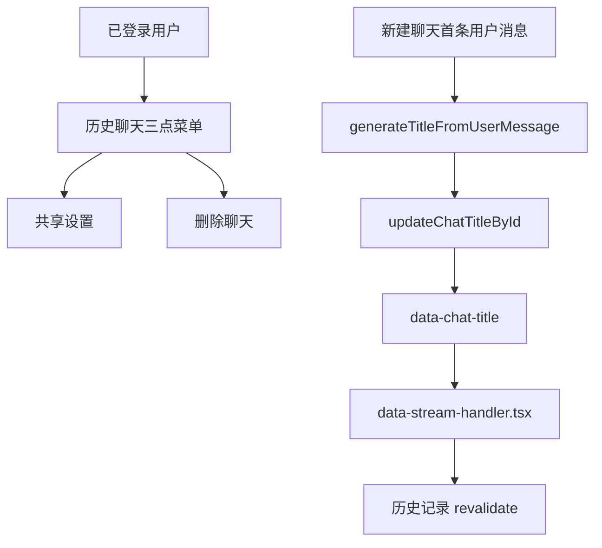
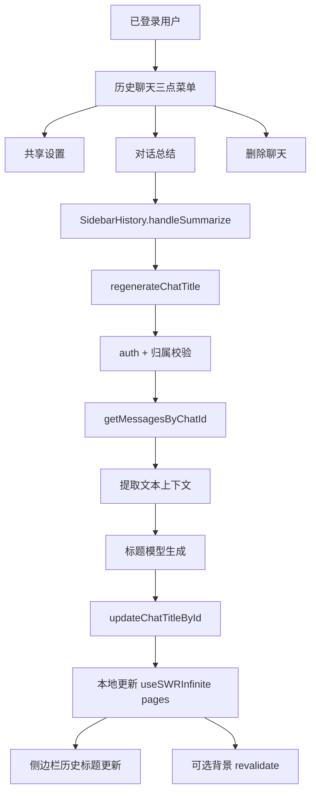

# 设计文档：历史聊天记录新增“对话总结”并重生成标题

## Overview

本设计将在历史聊天记录项的三点菜单中新增“对话总结”操作。用户点击后，系统会读取该聊天已有消息，提取可总结的文本上下文，调用现有标题模型生成一个新的简短标题，并将结果回写到 `Chat.title`，随后同步刷新左侧历史记录中的展示。

设计重点：

1. 复用现有标题生成模型与清洗逻辑；
2. 新增“按整段聊天内容重生成标题”的服务端动作；
3. 在侧边栏历史记录中即时更新缓存与展示；
4. 明确与现有 `data-chat-title` / `data-stream-handler.tsx` 同步机制的并存关系；
5. 清理遗留 rename 提示，避免用户被导向不存在的手动重命名入口。

本设计**不**新增数据库 schema，也**不**改变当前“新建聊天时根据首条用户消息生成初始标题”的逻辑。

---

## Architecture

### Current



### Target



### Key Changes

1. `components/chat/sidebar-history-item.tsx`
   - 新增“对话总结”菜单项
   - 接收新的触发回调与加载状态
2. `components/chat/sidebar-history.tsx`
   - 负责管理总结中的聊天 id
   - 调用服务端动作
   - 在成功后精确更新 `useSWRInfinite` 的多页历史记录缓存
3. `app/(chat)/actions.ts`
   - 新增 `regenerateChatTitle({ chatId })`
   - 复用或抽取标题生成 helper
4. `lib/ai/prompts.ts`
   - 新增“基于整段聊天总结标题”的 prompt
5. `lib/db/queries.ts`
   - 继续复用 `getChatById`、`getMessagesByChatId`、`updateChatTitleById`
6. `components/chat/slash-commands.tsx` / `lib/i18n/*`
   - 修正遗留 rename 提示，避免误导

---

## Components and Interfaces

### 1. 历史聊天菜单 UI：`components/chat/sidebar-history-item.tsx`

**职责：**
- 在单条历史聊天项的三点菜单中展示“对话总结”入口
- 将点击事件委托给父组件处理
- 根据当前 pending 状态禁用或提示正在生成

**建议新增 props：**

```ts
type ChatItemProps = {
  chat: Chat;
  isActive: boolean;
  onDelete: (chatId: string) => void;
  onSummarize: (chatId: string) => void;
  isSummarizing: boolean;
  setOpenMobile: (open: boolean) => void;
};
```

**目标行为：**
- 菜单结构调整为：
  1. 共享（保留现有子菜单）
  2. 对话总结（新增一级菜单项）
  3. 删除（保留）
- 当 `isSummarizing === true` 时：
  - 当前菜单项应禁用，或显示加载态文案/图标
  - 避免用户重复点击
- 不改变现有聊天跳转行为与分享设置逻辑

---

### 2. 历史记录状态管理：`components/chat/sidebar-history.tsx`

**职责：**
- 管理标题重生成的前端交互状态
- 调用服务端总结动作
- 更新分页历史记录缓存
- 在成功或失败时反馈用户

**建议新增本地状态：**

```ts
const [summarizingChatId, setSummarizingChatId] = useState<string | null>(null);
```

**建议新增处理流程：**

```ts
async function handleSummarize(chatId: string): Promise<void>
```

**处理步骤：**
1. 若已有 `summarizingChatId`，则阻止重复提交；
2. 设置当前 `summarizingChatId = chatId`；
3. 调用 `regenerateChatTitle({ chatId })`；
4. 成功后使用 `mutate` 更新 `paginatedChatHistories` 中对应聊天的 `title`；
5. 显示成功反馈；
6. 失败时保留旧标题并显示错误反馈；
7. 最终清理 `summarizingChatId`。

**精确缓存更新策略：**
- 当前历史记录的分组（today / yesterday / last7Days 等）是在渲染阶段由 `flatMap + groupChatsByDate` 计算的，不是缓存结构本身的一部分。
- 因此缓存更新应直接遍历 `useSWRInfinite` 已加载的分页数组 `pages[]`，并在每个 `page.chats[]` 中定位 `chat.id === targetId` 的条目。

建议实现方式：

```ts
mutate((pages) =>
  pages?.map((page) => ({
    ...page,
    chats: page.chats.map((chat) =>
      chat.id === targetId ? { ...chat, title: nextTitle } : chat
    ),
  })),
false)
```

随后可选追加一次背景 revalidate，用于在本地缓存之外再次与数据库状态对齐：

```ts
mutate();
```

**为什么由父组件管理状态：**
- 历史记录缓存与 `mutate` 已集中在 `SidebarHistory`
- 删除对话的确认逻辑也已在父组件中维护
- 这样可以避免 `ChatItem` 直接依赖 SWR 细节，使单项组件保持轻量

---

### 3. 服务端动作：`app/(chat)/actions.ts`

**职责：**
- 执行鉴权与聊天归属校验
- 读取聊天消息
- 基于聊天内容生成新标题
- 更新数据库并返回新标题

**建议接口：**

```ts
export async function regenerateChatTitle({
  chatId,
}: {
  chatId: string;
}): Promise<RegenerateChatTitleResult>;
```

**目标行为：**
1. 调用 `auth()` 验证用户会话；
2. 使用 `getChatById({ id: chatId })` 检查聊天是否存在且归属于当前用户；
3. 使用 `getMessagesByChatId({ id: chatId })` 获取该聊天的历史消息；
4. 从消息中抽取可总结文本；
5. 调用标题模型生成新标题；
6. 标题有效时调用 `updateChatTitleById({ chatId, title })`；
7. 返回 `{ chatId, title }` 给前端。

**失败场景：**
- 未登录 / 无权限：抛出未授权错误
- 找不到聊天：抛出 not found 或等效错误
- 无可总结文本：返回失败或抛出受控错误，但不更新原标题
- 模型返回空标题 / 数据库失败：中止更新并保持原标题

---

### 4. 标题生成逻辑复用与扩展：`app/(chat)/actions.ts` / `lib/ai/prompts.ts`

当前项目已有：
- `generateTitleFromUserMessage({ message })`
- `titlePrompt`
- `getTextFromMessage(message)`

它们主要用于**新建聊天时**根据**首条用户消息**生成初始标题。

本次需要新增“基于整段对话重生成标题”的能力，建议将标题生成逻辑拆为三层：

#### 4.1 通用标题生成 helper

```ts
async function generateTitleFromText({
  input,
  systemPrompt,
}: {
  input: string;
  systemPrompt: string;
}): Promise<string>
```

用途：
- 现有 `generateTitleFromUserMessage` 继续复用该 helper
- 新的 `regenerateChatTitle` 也复用同一 helper

#### 4.2 `getTextFromMessage` 与新 helper 的关系

- `getTextFromMessage(message)` 保留，继续服务于“单条 `UIMessage` → 文本”的现有标题生成场景。
- 新增 `buildConversationTitleSource(messages)`，服务于“多条 `DBMessage[]` → 对话摘要输入”的新场景。
- 两者不直接相互替换，因为输入类型不同；如后续发现文本提取逻辑重复，可再下沉为更底层的 text-part extractor，但这不是本次实现前置条件。

#### 4.3 新增对话总结 prompt

建议在 `lib/ai/prompts.ts` 中新增：

```ts
export const conversationTitlePrompt = `...`;
```

**Prompt 目标：**
- 基于整段对话生成一个适合历史记录展示的短标题
- 输出纯文本，不包含引号、Markdown、前缀
- 尽量反映对话最终聚焦主题，而不是原始寒暄

#### 4.4 对话文本提取策略

建议新增内部 helper：

```ts
function buildConversationTitleSource(messages: DBMessage[]): string
```

**提取规则：**
- 仅处理 `role` 为 `user` / `assistant` 的消息
- 仅提取 `parts` 中 `type === "text"` 的文本内容
- 忽略空字符串、工具调用结构、附件元数据、纯 artifact 控制数据
- 按时间顺序组织内容，必要时带上角色前缀（如 `User:` / `Assistant:`）

**上下文裁剪策略：**
- 保留首条有效用户消息，以维持初始主题语义
- 再优先保留最近若干条文本消息，以反映对话最终落点
- 对总输入设置**推荐上限 3000 字符**，超过后从中间裁剪冗余内容，优先保留“首条主题 + 最近上下文”

**推荐原因：**
- 仅用首条消息，可能无法体现对话后续收敛结果
- 直接发送全量原始消息，成本更高且噪声更多
- “首条主题 + 最近上下文 + 文本过滤”的方式在准确性与成本之间更平衡

---

### 5. 标题同步机制并存策略：`data-stream-handler.tsx` 与 server action

当前系统存在两条标题同步路径：

#### 路径 A：新建聊天自动标题
- 由 `api/chat` 流式执行
- 服务端写出 `data-chat-title`
- `components/chat/data-stream-handler.tsx` 监听后触发 `mutate(unstable_serialize(getChatHistoryPaginationKey))`

#### 路径 B：历史记录“对话总结”
- 由侧边栏 server action 触发
- 服务端直接返回 `RegenerateChatTitleResult`
- `SidebarHistory` 在本地精确更新 `useSWRInfinite` 的 `pages[].chats[]`
- 可选再触发背景 revalidate

**设计决策：**
- 本次“对话总结”**不走 data stream**。
- 原因是它不是聊天主流消息流的一部分，也不需要通过 streaming UI 增量呈现。
- 两条路径可以并存：
  - 自动标题继续由 data stream 驱动
  - 手动对话总结继续由 server action + local mutate 驱动

这样既避免为一次性菜单操作引入额外流式通道，也不会破坏现有自动标题逻辑。

---

### 6. 遗留 rename 提示处理：`components/chat/slash-commands.tsx` / `lib/i18n/*`

当前代码中存在：
- `/rename` slash command
- `renameAvailable` 相关提示文案

但当前真实 UI 并没有可用的手动重命名入口。

**本次设计要求：**
- 不把“对话总结”伪装为“手动重命名”能力
- 清理或修正会误导用户的 rename 文案
- `/rename` 若继续保留，应：
  1. 明确指向“历史记录菜单中的对话总结”；或
  2. 明确提示“手动 rename 暂未提供”

推荐优先采用方案 1，以减少遗留入口与新增功能之间的认知割裂。

---

## Data Models

本需求不新增数据库 schema。

### 1. 聊天标题

```ts
export type Chat = {
  id: string;
  createdAt: Date;
  title: string;
  userId: string;
  visibility: "public" | "private";
};
```

### 2. 标题生成输入（逻辑层）

```ts
type ConversationTitleSource = {
  role: "user" | "assistant";
  text: string;
}[];
```

### 3. 标题生成输出（逻辑层）

```ts
type RegenerateChatTitleResult = {
  chatId: string;
  title: string;
};
```

---

## Error Handling

### 错误分类

| 场景 | 行为 | 备注 |
|---|---|---|
| 未登录调用总结动作 | 返回未授权错误 | 原标题保持不变 |
| 当前用户不是聊天拥有者 | 返回拒绝访问错误 | 不泄露额外数据 |
| 聊天不存在 | 返回 not found 或受控错误 | 多见于缓存已过期 |
| 无可提取文本 | 返回受控失败结果 | 不写入空标题 |
| 模型生成空结果 | 保持原标题并报错 | 防止脏数据 |
| 数据库更新失败 | 保持原标题并报错 | UI 不做错误覆盖 |
| 用户重复点击 | 前端禁用重复提交 | 减少重复计费 |
| slash rename 提示与真实入口不一致 | 修正文案或映射到总结入口 | 防止交互误导 |

### Recovery Strategy

- 未授权：沿用现有重新登录流程或错误提示逻辑
- 聊天不存在：提示用户刷新历史记录
- 无可总结文本：提示无法生成摘要标题
- 模型或数据库失败：提示稍后重试，且不改动原标题
- rename 遗留提示：修正文案后不再出现虚假入口描述

---

## Testing Strategy

### Unit Tests
- `buildConversationTitleSource(messages)`
  - 只提取文本 part
  - 忽略空文本、工具 part、附件元数据
  - 保留正确的时间顺序与角色信息
  - 正确执行 3000 字符裁剪策略
- 标题清洗逻辑
  - 去除引号、Markdown、换行与首尾空白
  - 空结果不允许写库

### Server Action Tests
- 已登录且拥有聊天 -> 成功生成并更新标题
- 未登录 -> 返回未授权
- 聊天不属于当前用户 -> 返回拒绝访问
- 聊天没有可提取文本 -> 不更新标题
- 模型返回空内容 -> 不更新标题

### Integration / UI Tests
- 历史记录三点菜单出现“对话总结”入口
- 点击后该聊天进入加载/禁用状态
- 成功后侧边栏标题即时更新
- 非首页缓存中的聊天标题也能被正确更新
- 失败后侧边栏保持原标题并出现错误提示
- “共享”和“删除”功能未被破坏
- `/rename` slash command 或相关提示不再误导到不存在入口

### Regression Tests
- 新建聊天时的初始标题自动生成仍然正常
- `data-stream-handler.tsx` 驱动的自动标题刷新仍然正常
- 历史记录分页加载与删除功能仍然正常
- 分享可见性切换仍然正常
- 当前聊天页打开时，侧边栏标题更新不会破坏聊天消息流

---

## Decision Log

### Decision: 使用服务端动作而不是新增独立 API
**Context:** “对话总结”是侧边栏中由已登录用户触发的一次性写操作。

**Options Considered:**
1. 新增 Route Handler API
   - Pros: HTTP 错误结构更标准，便于 fetch 统一处理
   - Cons: 新增接口面，代码路径更长
2. 复用 `app/(chat)/actions.ts` 中的 server action
   - Pros: 与现有 `updateChatVisibility` 风格一致，改动最小
   - Cons: 客户端需要自行处理 action 抛错

**Decision:** 优先采用 server action。

**Rationale:** 当前项目已有侧边栏动作直接调用 server action 的先例，新增总结动作沿用同一路径更符合现有实现风格。

### Decision: 对话标题生成复用现有标题模型
**Context:** 系统已经存在专用标题模型配置与 provider 选项。

**Options Considered:**
1. 为对话总结单独引入模型配置
   - Pros: 可以独立调优
   - Cons: 配置、维护与排障成本更高
2. 复用现有 `TITLE_MODEL_ID`
   - Pros: 改动小、成本低、行为更一致
   - Cons: 需要通过 prompt 与输入构造区分“首条消息标题”和“整段对话标题”

**Decision:** 复用现有标题模型，通过 prompt 与输入构造区分两类场景。

**Rationale:** 本需求重点是补充入口与上下文来源，而不是建立新的模型能力链路。

### Decision: 采用“首条主题 + 最近上下文 + 3000 字符上限”的标题输入策略
**Context:** 全量聊天内容可能过长，且包含大量对标题无帮助的结构化数据。

**Options Considered:**
1. 仅使用首条用户消息
   - Pros: 成本最低
   - Cons: 无法反映对话后续收敛主题
2. 使用全量消息原文
   - Pros: 信息最全
   - Cons: 成本高、噪声大
3. 使用过滤后的有限上下文
   - Pros: 在成本与准确性之间平衡
   - Cons: 需要额外的提取与裁剪逻辑

**Decision:** 使用过滤后的有限上下文，并保留首条有效用户消息与最近对话片段，总输入推荐控制在 3000 字符以内。

**Rationale:** 这最符合“重新生成此聊天摘要标题”的需求，也能控制模型调用成本。

### Decision: 保持 data stream 与 server action 两套标题同步路径并存
**Context:** 现有自动标题与新增手动总结触发点不同。

**Options Considered:**
1. 强行统一为 data stream 路径
   - Pros: 同步机制表面统一
   - Cons: 为一次性菜单操作引入不必要的流式复杂度
2. 强行统一为 server action 路径
   - Pros: 实现方式更直观
   - Cons: 会干扰现有聊天主流的 streaming 结构
3. 按触发场景保留双路径
   - Pros: 改动最小、职责清晰
   - Cons: 需要文档明确说明并存关系

**Decision:** 保留双路径。

**Rationale:** 自动标题与手动总结分别服务不同交互场景，没必要为了一致性牺牲现有主流程结构。

---

## Implementation Notes

推荐按以下顺序落地：

1. 先抽取通用标题生成 helper，并新增 conversation title prompt；
2. 再实现 `regenerateChatTitle` 服务端动作；
3. 然后为 `SidebarHistory` / `ChatItem` 增加菜单入口、加载态与缓存同步；
4. 再修正 `/rename` 遗留提示与 i18n 文案；
5. 最后补齐测试与手工验证。

这样可以先打通“服务端可正确生成并更新标题”的核心链路，再叠加前端交互层与遗留清理。
